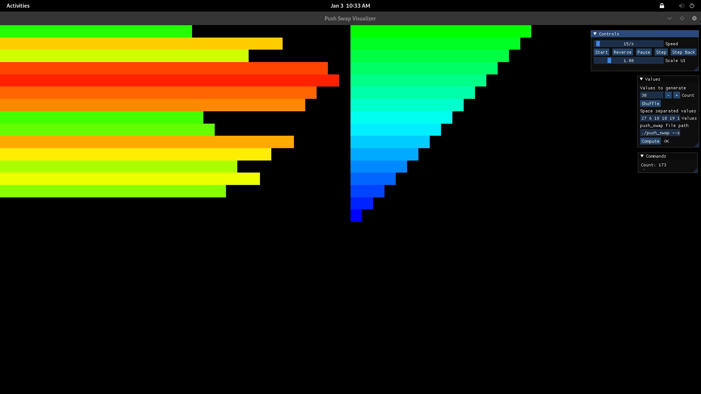
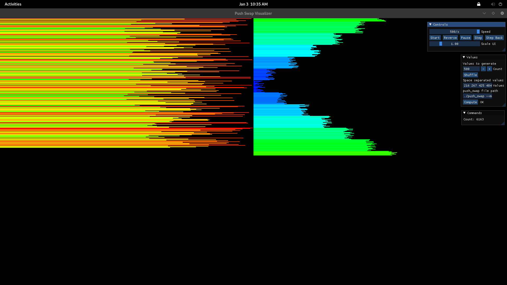
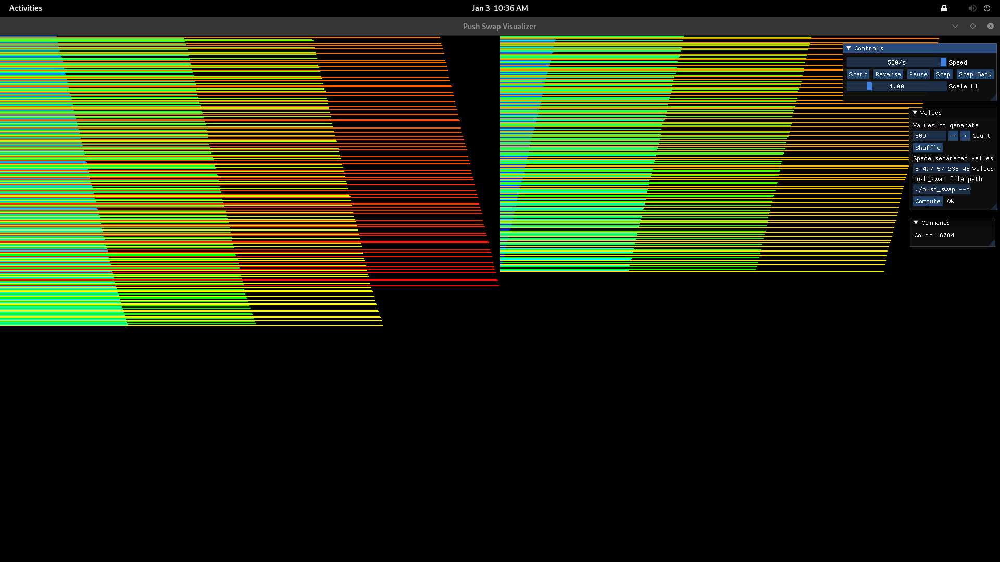

*This project has been created as part of the 42 curriculum by mfakih, mitani.*

# push_swap

## Description

**push_swap** is a sorting algorithm project where the goal is to sort a stack of integers using a very limited set of operations and the smallest possible number of moves.

The project focuses on:

* Algorithmic thinking and optimization
* Understanding complexity trade-offs
* Writing clean, memory-safe C code
* Designing adaptive strategies instead of a single rigid algorithm

The program takes a list of integers, builds **stack A**, and sorts it in ascending order using an auxiliary **stack B**, while printing the sequence of operations to standard output.

This implementation goes beyond a single strategy by introducing an **adaptive sorting system** based on a measured disorder metric, with explicit algorithm selection flags for benchmarking and testing.

---

## Instructions

### Compilation

Compile the project using:

```bash
make
```

This will generate the executable:

```bash
./push_swap
```

---

### Execution

Basic usage:

```bash
./push_swap 3 2 1
```

The program prints the list of operations required to sort the numbers.

---

### Running with the checker

To verify correctness, pipe the output into the official checker:

```bash
ARG="4 67 3 87 23"; ./push_swap --complex $ARG | ./checker_linux $ARG
```

If the output is correct, the checker will display `OK`.

---

### Benchmarking & Stress Testing

Generate a large random input and benchmark the algorithm:

```bash
shuf -i 0-9999 -n 500 > args.txt
./push_swap --bench $(cat args.txt) 2> bench.txt | ./checker_linux $(cat args.txt)
```

* `bench.txt` will contain detailed statistics
* Standard output remains compatible with the checker

---

## Visualization & Algorithm Walkthrough

The following visualizations were generated using a **push_swap visualizer** to observe how each algorithm behaves internally. Colors represent relative values (small → blue/green, large → yellow/red), and bar length reflects magnitude.

### Simple Algorithm — Selection-Based (`O(n²)`)



This strategy behaves similarly to **selection sort**:

* Repeatedly searches for the minimum value in stack **A**
* Pushes the minimum to stack **B**
* Once stack **A** is empty or nearly sorted, values are pushed back **blindly** to **A**

This approach minimizes logic overhead and performs very well on:

* Small inputs
* Nearly sorted stacks

It is intentionally simple and predictable, making it ideal when the disorder metric is low.

---

### Medium Algorithm — Chunking Strategy (`O(n√n)`)



This algorithm introduces **chunk-based sorting**:

* Values are divided into logical chunks based on rank
* Elements are pushed to stack **B** in partially sorted order
* While reinserting into **A**, the algorithm decides dynamically whether to:

  * rotate (`rb`)
  * or reverse rotate (`rrb`)

The goal is to always push back the **maximum value first**, reducing unnecessary rotations.

This balances move count and complexity, serving as a midpoint between simple selection and full radix sorting.

---

### Complex Algorithm — Radix-Inspired (`O(n log n)`)



The complex strategy is inspired by **radix sorting**:

* Values are indexed and processed bit-by-bit
* Elements are distributed between stacks based on binary representation
* Each pass guarantees partial ordering until the stack is fully sorted

This algorithm provides:

* Stable performance
* Predictable scaling
* Best results for large, highly disordered inputs

It is the default choice when the disorder metric exceeds a defined threshold, or when explicitly forced via the `--complex` flag.

---

## Algorithms & Technical Choices

### Disorder Metric

Before sorting, the program computes a **disorder ratio**:

* Counts inverted pairs `(i, j)` where `i < j` but `a[i] > a[j]`
* Normalizes by total possible pairs
* Produces a value in range `[0.0 – 1.0]`

This metric is used to **adaptively select the most efficient algorithm**.

---

### Sorting Strategies

#### 1. Simple Algorithm — `O(n²)`

* Selection-based logic
* Efficient for nearly sorted inputs
* Minimal overhead

Automatically chosen when disorder is low.

---

#### 2. Medium Algorithm — `O(n√n)`

* Chunk-based strategy
* Balances number of pushes and rotations
* Designed as a midpoint between simplicity and scalability

---

#### 3. Complex Algorithm — `O(n log n)`

* Radix-inspired / bitwise-aware approach
* Stable performance for large inputs
* Chosen automatically for highly disordered stacks

Can also be explicitly forced using:

./push_swap --complex <args>

---

### Adaptive Mode (Default)

Without flags, the program:

1. Measures disorder
2. Selects the optimal algorithm dynamically
3. Sorts with minimal overhead

This avoids overusing complex logic on simple inputs.

---

### Optimized 3-Element Sorting

A dedicated **3-element sorting optimization** is implemented:

* Uses at most **2 operations**
* Covers all permutations explicitly
* Bypasses the adaptive system entirely

This significantly reduces move count and improves scoring for small inputs.

---

## Resources

### Algorithm References

* Stack-based sorting problems
* Radix sort and binary decomposition
* Adaptive algorithm selection
* Complexity analysis (`O(n²)`, `O(n log n)`)

Useful references:

* Wikipedia: Sorting Algorithms
* 42 push_swap subject PDF
* Radix Sort documentation

---

### Use of AI

AI tools (ChatGPT) were used for:

* Concept validation and brainstorming
* Explaining complexity trade-offs
* Valgrid output interpretation

All final algorithm design, implementation, debugging, and optimization decisions were made by the authors.

---

## Notes

* Fully Valgrind-clean
* Norm-compliant
* Designed for clarity, adaptability, and performance

This project prioritizes **reasoned algorithm choice** over brute-force optimization.
